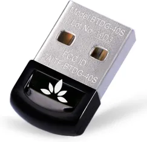

# Sony WH-CH700N vs Bluetooth Dongles and Windows 10

With businesses being forced to see the light on the issue facilitating and encouraging remote work due to COVID-19, many people suddenly found themselves in need of decent headsets to keep up with all those Zoom meetings – myself included. I decided it was time to get a new headset for myself. After some (admittedly light) research, I found the Sony WH-CH700N noise cancelling headphones on sale at BestBuy.

https://www.sony.com/electronics/headband-headphones/wh-ch700n

After I got them I was dismayed to find out that they worked for my laptop, but not my Desktop. Months passed and I googled everything I could think of. Nothing. First I tried replacing my ASUS BT-400 bluetooth USB adapter with a “newer” Insignia adapter with no luck. Then I blamed Windows 10 1909 and assumed they had broken something and left it at that.

I would “pair” them successfully with Windows only to then get an error that they could not be found: “your devices are paired but not connected“

Most of the posts I found (like this one: https://www.drivereasy.com/knowledge/fix-bluetooth-paired-but-not-connected-error-on-windows-10/), did not solve my issues.

Finally, two weeks ago I decided to roll the dice again. I typed every variation of Google search I could think of and finally found a single support post where it was suggested that the issue was being caused by a lack of Advanced Audio Distribution Profile (A2DP) support, which is apparently required by the headset. In wary desperation I ordered a new bluetooth USB adapter that explicitly touted support for A2DP: the Avantree DG40S.

https://www.amazon.com/Avantree-Bluetooth-Computer-Keyboard-Warranty/dp/B00VWEK4IG/ref=sr_1_3?dchild=1&keywords=Avantree+DG40S+USB+Bluetooth+Adapter+for+PC&qid=1599948292&s=electronics&sr=1-3

And…

IT WORKED!

Not much more to say about it. If you are encountering these issues with your WH-CH700N, try getting a bluetooth adapter that supports A2DP.